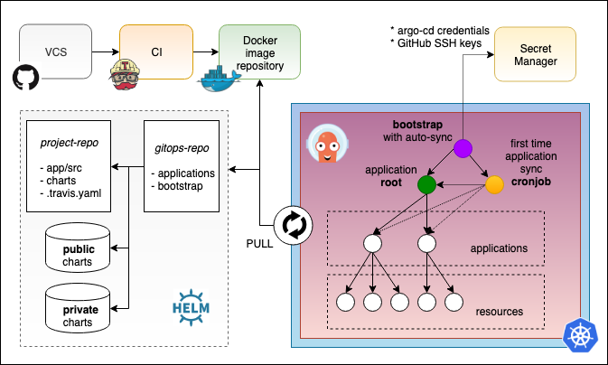

# gitops-k8s

This document aim to provide an opinioted working solutions leveraging Kubernetes and proven GitOps techniques to have a resilient and scalable architecture and to allow developers to spend more time on actual business problems rather boring and error prone infrastructure issues.

Nothing of what is outlined below is new or innovative, but it should be at least a good starting point to have something cheap and up&running pretty quickly and give you a chance to try out new ideas with zero time.

Feedback and helps are always welcome!

## Introduction

### TL;DR

* Kubernetes is a declarative system
* Git can be used to describe infrastructure and applications
* GitOps is a way to do Continuous Delivery and operate Kubernetes via Git pull requests
* GitOps empowers developers to do operations
* CI pipelines should only run builds, tests and publish images
* In a pull-based approach, an operator deploys new images from inside of the cluster
* You can only observe the actual state of the cluster and react when it diverge from the desiderd one

### Imperative vs Declarative

In an *imperative* system, the user knows the desired state, determines the sequence of commands to transition the system to the desired state and supplies a representation of the commands to the system.

By contrast, in a *declarative* system, the user knows the desired state, supplies a representation of the desired state to the system, then the system reads the current state and determines the sequence of commands to transition the system to the desired state.

Declarative systems have the distinct advantage of being able to react to unintended state changes without further supervision. In the event of an unintended state change leading to a state drift, the system may autonomously determine and apply the set of mitigating actions leading to a state match. This process is called a **control loop**, a popular choice for the implementation of controllers.

### What is GitOps?

GitOps is the art and science of using Git pull requests to manage infrastructure provisioning and software deployment.

The concept of GitOps originated at Weaveworks, whose developers described how they use Git to create a **single source of truth**.

Kubernetes is a **declarative** system and by using declarative tools, the entire set of configuration files can be version controlled in Git.

More generally, GitOps is a way to do Continuous Delivery and operate Kubernetes via Git.

### Push vs Pull

In a *push*-based pipeline, the CI system runs build and tests, followed by a deployment directly to Kubernetes. This is an *anti-pattern*. CI server is not an orchestration tool. You need something that continually attempts to make progress until there are no more diffs because CI fails when it encounters a difference and then you could end up being in a partial and unknown state.

In a *pull*-based pipeline, a Kubernetes **operator** deploys new images from inside of the cluster. The operator notices when a new image has been pushed to the registry. Convergence of the cluster state is then triggered and the new image is pulled from the registry, the manifest is automatically updated and the new image is deployed to the cluster.

A CI pipeline should be used to merge and integrate updates with master, while with GitOps you should rely on Kubernetes or the cluster to internally manage deployments based on those master updates.

You could potentially have multiple cluster pointing to the same GitOps repo, but you won't have a centralized view of them, all the clusters will be independent.

### Observability

Git provides a source of truth for the desired state of the system and *observability* provides a source of truth for the actual state of the running system.

You cannot say what actual state is in the cluster. You can only observe it. This is why diffs are so important.

A system is observable if developers can understand its current state from the outside. Observability is a property of systems like Availability and Scalability. Monitoring, Tracing and Logging are techniques for baseline observations.

Observability is a source of truth for the actual running state of the system right now. You observe the running system in order to understand and control it. Observed state must be compared with the desired state in Git and usually you want to monitor and alert when the system diverge from the desired state.

### Resources

* [Imperative vs Declarative](https://medium.com/@dominik.tornow/imperative-vs-declarative-8abc7dcae82e)
* [GitOps - Operations by Pull Request](https://www.weave.works/blog/gitops-operations-by-pull-request) (Part 1)
* [The GitOps Pipeline](https://www.weave.works/blog/the-gitops-pipeline) (Part 2)
* [GitOps - Observability](https://www.weave.works/blog/gitops-part-3-observability) (Part 3)
* [GitOps - Application Delivery Compliance and Secure CICD](https://www.weave.works/blog/gitops-compliance-and-secure-cicd) (Part 4)
* [What is GitOps really?](https://www.weave.works/blog/what-is-gitops-really)
* [Why is a PULL vs a PUSH pipeline important?](https://www.weave.works/blog/why-is-a-pull-vs-a-push-pipeline-important)
* [Kubernetes anti-patterns: Let's do GitOps, not CIOps!](https://www.weave.works/blog/kubernetes-anti-patterns-let-s-do-gitops-not-ciops)
* [GitOps: High velocity CICD for Kubernetes](https://www.weave.works/blog/gitops-high-velocity-cicd-for-kubernetes)
* [GitOps - What you need to know](https://www.weave.works/technologies/gitops)
* [GitOps for Kubernetes - A DevOps Iteration Focused on Declarative Infrastructure](https://youtu.be/wJleh-6DZJ0)
* [Automating continuous delivery with Kubernetes, Google Cloud and Git](https://vimeo.com/255633066)
* [Continuous Delivery the Hard Way](https://www.weave.works/blog/continuous-delivery-the-hard-way)

## Argo CD



This guide will explain how to setup the whole infrastructure on DigitalOcean using GitOps and Argo CD. Note that this setup is not tightly coupled to any specific vendor and you should be able to easily port it on [EKS](https://aws.amazon.com/eks) or [GKE](https://cloud.google.com/kubernetes-engine) for example.

Most of the steps have been kept manual on purpose, but should be automated in a production enviroment.

### Prerequisites

* Documentation of how create a Kubernetes on [DigitalOcean](https://www.digitalocean.com/docs/kubernetes)
    * $10/month for worker node
    * $10/month for Load Balancer
* kubectl [setup](https://kubernetes.io/docs/tasks/tools/install-kubectl)
* Helm [setup](https://helm.sh/docs/using_helm/#installing-helm) and [intro](https://niqdev.github.io/devops/kubernetes/#helm)
* Download cluster configs and test connection
    ```bash
    export KUBECONFIG=~/.kube/CLUSTER_NAME-kubeconfig.yaml
    kubectl get nodes
    ```

### How it works?

TODO

You need to embrace failures if you want to be able to recover automatically from that e.g. initContainer

### Resources

* [Introducing Argo CD](https://blog.argoproj.io/introducing-argo-cd-declarative-continuous-delivery-for-kubernetes-da2a73a780cd)
* [Argo CD - Declarative Continuous Delivery for Kubernetes](https://argoproj.github.io/argo-cd)

## Contributors

Thanks to [@conorfennell](https://github.com/conorfennell) and [@mduarte](https://github.com/mduarte) to envision this path, lie down the foundation of this project and promote GitOps in our teams!

TODO (not in order)

[ ] Setup [prometheus-operator](https://github.com/coreos/prometheus-operator) for monitoring and alerting + diagram of how it works
[ ] Setup Fluent Bit and Elasticsearch for logging + diagram of how it works
[ ] open source `argocd-bootstrap` with cronjob
[ ] [metric-server](https://github.com/kubernetes-incubator/metrics-server) e.g. `kubectl top nodes`
[ ] [Ambassador](https://www.getambassador.io) vs [Istio](https://istio.io)
[ ] Default Grafana [dashboards](https://grafana.com/dashboards)
[ ] [Jaeger](https://www.jaegertracing.io) tracing
[ ] chaos monkey
