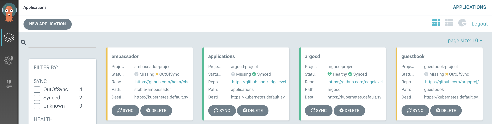
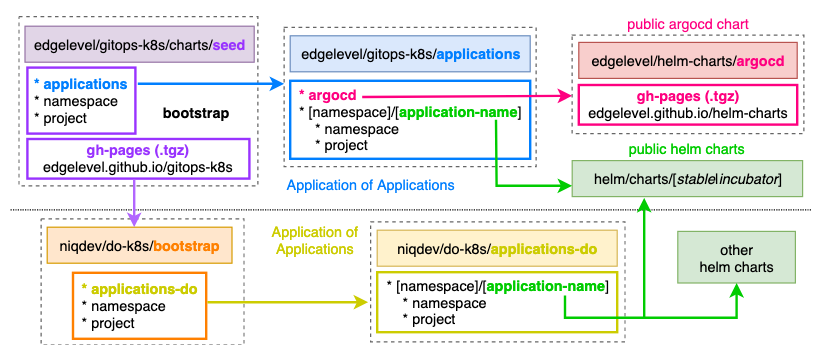

# gitops-k8s

[![Build Status][travis-image]][travis-url]

[travis-image]: https://travis-ci.org/edgelevel/gitops-k8s.svg?branch=master
[travis-url]: https://travis-ci.org/edgelevel/gitops-k8s

This document aims to provide an opinionated working solution leveraging Kubernetes and proven GitOps techniques to have a resilient, composable and scalable Kubernetes platform.

Nothing outlined below is new or innovative, but it should be at least a good starting point to have a cluster up and running pretty quickly and give you a chance to remain focused and try out new ideas.

Feedback and help are always welcome!

* [Introduction](#introduction)
* [Argo CD](#argo-cd)
* [Applications](#applications)

---

## Introduction

### TL;DR

* Kubernetes is a declarative system
* Git can be used to describe infrastructure and applications
* Git repository is the source of truth and represents a cluster
* GitOps is a way to do Continuous Delivery and operate Kubernetes via Git pull requests
* GitOps empowers developers to do operations
* CI pipelines should only run builds, tests and publish images
* In a pull-based approach, an operator deploys new images from inside of the cluster
* You can only observe the actual state of the cluster and react when it diverges from the desired state

### Imperative vs Declarative

In an *imperative* system, the user knows the desired state, determines the sequence of commands to transition the system to the desired state and supplies a representation of the commands to the system.

By contrast, in a *declarative* system, the user knows the desired state, supplies a representation of the desired state to the system, then the system reads the current state and determines the sequence of commands to transition the system to the desired state.

Declarative systems have the distinct advantage of being able to react to unintended state changes without further supervision. In the event of an unintended state change leading to a state drift, the system may autonomously determine and apply the set of mitigating actions leading to a state match. This process is called a **control loop**, a popular choice for the implementation of controllers.

### What is GitOps?

GitOps is the art and science of using Git pull requests to manage infrastructure provisioning and software deployment.

The concept of GitOps originated at Weaveworks, whose developers described how they use Git to create a **single source of truth**. Kubernetes is a **declarative** system and by using declarative tools, the entire set of configuration files can be version controlled in Git.

More generally, GitOps is a way to do Continuous Delivery and operate Kubernetes via Git.

### Push vs Pull

In a *push*-based pipeline, the CI system runs build and tests, followed by a deployment directly to Kubernetes. This is an *anti-pattern*. CI server is not an orchestration tool. You need something that continually attempts to make progress until there are no more diffs because CI fails when it encounters a difference and then you could end up being in a partial and unknown state.

In a *pull*-based pipeline, a Kubernetes **operator** deploys new images from inside of the cluster. The operator notices when a new image has been pushed to the registry. Convergence of the cluster state is then triggered and the new image is pulled from the registry, the manifest is automatically updated and the new image is deployed to the cluster.

A CI pipeline should be used to merge and integrate updates with master, while with GitOps you should rely on Kubernetes or the cluster to internally manage deployments based on those master updates.

You could potentially have multiple cluster pointing to the same GitOps repository, but you won't have a centralized view of them, all the clusters will be independent.

### Observability

Git provides a source of truth for the desired state of the system and *observability* provides a source of truth for the actual state of the running system.

You cannot say what actual state is in the cluster. You can only observe it. This is why diffs are so important.

A system is observable if developers can understand its current state from the outside. Observability is a property of systems like Availability and Scalability. Monitoring, Tracing and Logging are techniques for baseline observations.

Observability is a source of truth for the actual running state of the system right now. You observe the running system in order to understand and control it. Observed state must be compared with the desired state in Git and usually you want to monitor and alert when the system diverge from the desired state.

**Resources**

* [Imperative vs Declarative](https://medium.com/@dominik.tornow/imperative-vs-declarative-8abc7dcae82e)
* [GitOps - Operations by Pull Request](https://www.weave.works/blog/gitops-operations-by-pull-request) (Part 1)
* [The GitOps Pipeline](https://www.weave.works/blog/the-gitops-pipeline) (Part 2)
* [GitOps - Observability](https://www.weave.works/blog/gitops-part-3-observability) (Part 3)
* [GitOps - Application Delivery Compliance and Secure CICD](https://www.weave.works/blog/gitops-compliance-and-secure-cicd) (Part 4)
* [Making the Leap from Continuous Integration to Continuous Delivery](docs/Weaveworks_ContinuousDelivery_wp_2018.pdf) (Whitepaper)
* [What is GitOps really?](https://www.weave.works/blog/what-is-gitops-really)
* [Why is a PULL vs a PUSH pipeline important?](https://www.weave.works/blog/why-is-a-pull-vs-a-push-pipeline-important)
* [Kubernetes anti-patterns: Let's do GitOps, not CIOps!](https://www.weave.works/blog/kubernetes-anti-patterns-let-s-do-gitops-not-ciops)
* [GitOps: High velocity CICD for Kubernetes](https://www.weave.works/blog/gitops-high-velocity-cicd-for-kubernetes)
* [GitOps - What you need to know](https://www.weave.works/technologies/gitops)
* [GitOps for Kubernetes - A DevOps Iteration Focused on Declarative Infrastructure](https://youtu.be/wJleh-6DZJ0)
* [Automating continuous delivery with Kubernetes, Google Cloud and Git](https://vimeo.com/255633066)
* [Continuous Delivery the Hard Way](https://www.weave.works/blog/continuous-delivery-the-hard-way)

## Argo CD

Argo CD is a declarative, GitOps continuous delivery tool for Kubernetes. It automates the deployment of the desired application states in the specified target environments. In this project Kubernetes manifests are specified as [helm](https://helm.sh/docs) charts.

This guide will explain how to setup in few steps the whole infrastructure via GitOps with Argo CD. Note that it's not tightly coupled to any specific vendor and you should be able to easily run it on [DigitalOcean](https://www.digitalocean.com/docs/kubernetes), [EKS](https://aws.amazon.com/eks) or [GKE](https://cloud.google.com/kubernetes-engine) for example.

<!--
You need to embrace failures if you want to have the ability to heal and recover automatically in most of the situations. A useful pattern is to have an `initContainer` to solve dependencies between various resources. For example a Kafka application should check if topics have been properly created (ideally by an operator) before even start.
-->


Most of the steps have been kept manual on purpose, but they should be automated in a production enviroment.

### Prerequisites

* [Setup](docs/setup.md) required tools
* Create a Kubernetes cluster locally or with your favourite provider
* Download the cluster configs and test connection
    ```bash
    export KUBECONFIG=~/.kube/<CLUSTER_NAME>-kubeconfig.yaml
    kubectl get nodes
    ```

### Bootstrap

1. *TODO Setup secrets (optional)*
2. Setup Argo CD and all the applications
    ```bash
    make bootstrap
    ```
3. Access Argo CD
    ```bash
    # username: admin
    # password: (autogenerated) the pod name of the Argo CD API server
    kubectl get pods -n argocd -l app.kubernetes.io/name=argocd-server -o name | cut -d'/' -f 2

    # port forward the service
    kubectl port-forward service/argocd-server -n argocd 8080:443

    # from the UI
    [open|xdg-open] https://localhost:8080
    # from the CLI
    argocd login localhost:8080 --username admin
    ```
    * You might need to *Allow invalid certificates for resources loaded from localhost* on Chrome enabling the flag `chrome://flags/#allow-insecure-localhost` to access it
4. First time only sync all the `OutOfSync` applications
    * manually
    * *TODO with a cronjob (optional)*
    * verify [guestbook](https://github.com/argoproj/argocd-example-apps/tree/master/guestbook) example
    ```bash
    # port forward the service
    kubectl port-forward service/guestbook-ui -n guestbook 8081:80
    # open browser
    [open|xdg-open] http://localhost:8081
    ```

This is how it should looks like on the UI



**Resources**

* [Introducing Argo CD](https://blog.argoproj.io/introducing-argo-cd-declarative-continuous-delivery-for-kubernetes-da2a73a780cd)
* [Argo CD - Declarative Continuous Delivery for Kubernetes](https://argoproj.github.io/argo-cd)

## Applications

Applications in this repository are defined in the parent [applications](applications/templates) chart and are logically split into folders which represent Kubernetes namespaces.



**`ambassador`** namespace is dedicated for [Ambassador](https://www.getambassador.io), a lightweight Kubernetes-native microservices API gateway built on the Envoy Proxy which is mainly used for routing and supports canary deployments, traffic shadowing, rate limiting, authentication and more
```bash
# retrieve EXTERNAL-IP
kubectl get service ambassador -n ambassador
[open|xdg-open] http://<EXTERNAL-IP>/ambassador
[open|xdg-open] http://<EXTERNAL-IP>/httpbin/
[open|xdg-open] http://<EXTERNAL-IP>/guestbook

# debug ambassador
kubectl port-forward service/ambassador-admins 8877 -n ambassador
[open|xdg-open] http://localhost:8877/ambassador/v0/diag
```

*Ambassador is [disabled](applications/values.yaml) by default because the recommended way is to use host-based routing which requires a domain*

For a working example on DigitalOcean using [`external-dns`](https://github.com/helm/charts/tree/master/stable/external-dns) you can have a look at [niqdev/do-k8s](https://github.com/niqdev/do-k8s)

*TODO Service mesh*

* [Istio](https://istio.io)
* [A Crash Course For Running Istio](https://medium.com/namely-labs/a-crash-course-for-running-istio-1c6125930715)

**`observe`** namespace is dedicated for observability and in the specific Monitoring, Alerting and Logging

* [`prometheus-operator`](https://github.com/helm/charts/tree/master/stable/prometheus-operator) provides monitoring and alerting managing Prometheus, Alertmanager and Grafana
    ```bash
    # prometheus
    kubectl port-forward service/prometheus-operator-prometheus 8001:9090 -n observe

    # alertmanager
    kubectl port-forward service/prometheus-operator-alertmanager 8002:9093 -n observe

    # grafana
    # username: admin
    # password: prom-operator
    kubectl port-forward service/prometheus-operator-grafana 8003:80 -n observe
    ```

* [`kube-ops-view`](https://github.com/helm/charts/tree/master/stable/kube-ops-view) provides a read-only system dashboard for multiple k8s clusters
    ```bash
    kubectl port-forward service/kube-ops-view -n observe 8004:80
    ```

*EFK stack for logging*

* [`elasticsearch`](https://github.com/elastic/helm-charts/tree/master/elasticsearch) is a distributed, RESTful search and analytics engine and it's is used for log storage
    ```bash
    kubectl port-forward service/elasticsearch-master 9200:9200 -n observe
    ```

* [`cerebro`](https://github.com/helm/charts/tree/master/stable/cerebro) is an Elasticsearch web admin tool
    ```bash
    kubectl port-forward service/cerebro 9000:80 -n observe
    ```

* [`kibana`](https://github.com/elastic/helm-charts/tree/master/kibana) visualize and query the log data stored in an Elasticsearch index
    ```bash
    kubectl port-forward service/kibana-kibana 9001:5601 -n observe
    ```
* [`fluentbit`](https://github.com/helm/charts/tree/master/stable/fluent-bit) is a fast and lightweight Log Processor and Forwarder

* [`elasticsearch-curator`](https://github.com/helm/charts/tree/master/stable/elasticsearch-curator) or [`curator`](https://github.com/giantswarm/curator) helps to curate, or manage, Elasticsearch indices and snapshots

**Resources**

* [Prometheus](https://prometheus.io/docs/introduction/overview)
* Prometheus Operator - [Getting Started Guide](https://coreos.com/operators/prometheus/docs/latest/user-guides/getting-started.html)
* Grafana - [Dashboards](https://grafana.com/dashboards)
* [Fluent Bit](https://docs.fluentbit.io/manual)
* [Logging Best Practices for Kubernetes using Elasticsearch, Fluent Bit and Kibana](https://itnext.io/logging-best-practices-for-kubernetes-using-elasticsearch-fluent-bit-and-kibana-be9b7398dfee)
* [Exporting Kubernetes Logs to Elasticsearch Using Fluent Bit](https://supergiant.io/blog/exporting-kubernetes-logs-to-elasticsearch-using-fluent-bit)
* [Fluentd vs. Fluent Bit: Side by Side Comparison](https://logz.io/blog/fluentd-vs-fluent-bit)
* [Logging & Monitoring of Kubernetes Applications: Requirements & Recommended Toolset](https://platform9.com/blog/logging-monitoring-of-kubernetes-applications-requirements-recommended-toolset)
* [Loki](https://github.com/grafana/loki)

**`kube-system`** namespace is reserved for Kubernete system applications

* [`kubernetes-dashboard`](https://github.com/helm/charts/tree/master/stable/kubernetes-dashboard) is a general purpose, web-based UI for Kubernetes clusters. It allows users to manage applications running in the cluster and troubleshoot them, as well as manage the cluster itself
    ```bash
    kubectl port-forward service/kubernetes-dashboard -n kube-system 8000:443
    ```

* [`metrics-server`](https://github.com/helm/charts/tree/master/stable/metrics-server) is an add-on which extends the metrics api group and enables the Kubernetes resource `HorizontalPodAutoscaler`
    ```bash
    kubectl top node
    kubectl top pod --all-namespaces
    ```

* [`spotify-docker-gc`](https://github.com/helm/charts/tree/master/stable/spotify-docker-gc) performs garbage collection in the Kubernetes cluster and the default configurations have the gc running once a day which:
    * removes containers that exited more than a hour ago
    * removes images that don't belong to any container
    * removes volumes that are not associated to any remaining container

---

## TODO (not in order)

* [ ] argocd: example secrets for private charts
* [ ] argocd: override default `admin.password`
* [ ] argocd: example login with GitHub
* [ ] argocd: explain solution of how to sync automatically first time with cronjob
* [ ] [Jaeger](https://www.jaegertracing.io) tracing
* [ ] [kube-monkey](https://github.com/asobti/kube-monkey) or [chaoskube](https://github.com/helm/charts/tree/master/stable/chaoskube)
* [ ] switch cluster via DNS
* [ ] Kafka from public chart + [JMX fix](https://github.com/helm/charts/pull/10799/files)
* [ ] stateless vs stateful: how to restore state if source of truth
* [ ] Example with multiple providers: DigitalOcean, EKS, GKE
* [ ] Add prometheus adapter for custom metrics that can be used by the [HorizontalPodAutoscaler](https://kubernetes.io/docs/tasks/run-application/horizontal-pod-autoscale)
* [ ] Verify/fix argocd version `version: 1.0.0-0` with `appVersion`
* [ ] Explain how to test a branch - change target revision from the UI
* [ ] TODO fix `alertmanager: error: unrecognized log format "<nil>", try --help`
